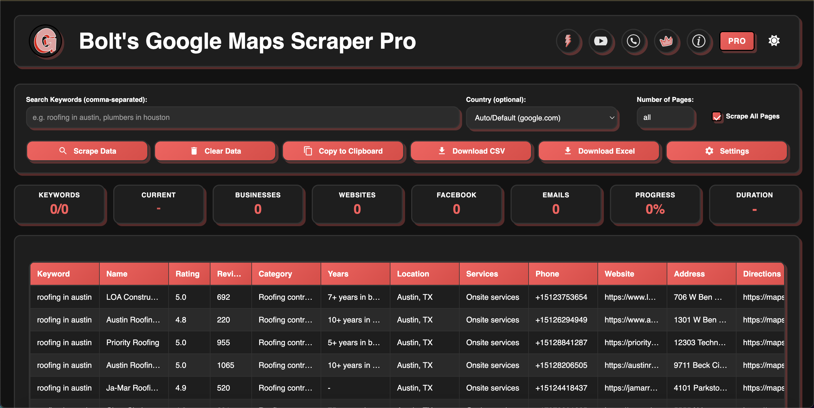

# FREE Google Maps Scraper - Extract Unlimited Business Leads! 

The **100% FREE** and most powerful Chrome extension to extract business data from Google Maps in 2025! Download now and start generating leads in minutes!

## ⭐ Why Choose Our FREE Google Maps Scraper?

- **COMPLETELY FREE** - No hidden fees or subscriptions!
- **NO CODING REQUIRED** - Simple point-and-click interface
- **EXTRACT UNLIMITED LEADS** - Generate thousands of business contacts
- **EXPORT INSTANTLY** - Save data to CSV, Excel, or clipboard
- **LIGHTWEIGHT & FAST** - Uses minimal system resources

### 🎁 What You Get FOR FREE:
- ✅ Business name, address, phone number
- ✅ Rating, reviews, years in business 
- ✅ Location and service details
- ✅ Website URLs
- ✅ Export to multiple formats
- ✅ Regular updates

### 🚀 Premium Version (Optional Upgrade):
- 📧 2 Business emails per listing
- 🔗 Social media links (Facebook, Instagram, LinkedIn, YouTube, TikTok)
- 🎯 Bulk keyword scraping
- ♾️ No daily usage limits
- 🛡️ Priority support

[TRY PRO VERSION](https://boltscraper.com/google-maps-scraper) 

## 📥 Quick Installation (Takes Less Than 60 Seconds!)

1. Download this **FREE** repository as a ZIP file
2. Extract the files to your computer
3. Open Chrome browser
4. Go to `chrome://extensions/`
5. Toggle "Developer mode" on (top-right corner)
6. Click "Load unpacked"
7. Select the extracted folder
8. Start scraping immediately!

## 🔍 How To Use Our FREE Scraper (So Easy Anyone Can Do It!)

1. Open Google Maps in your browser
2. Search for any business type (e.g., "dentists in Chicago", "lawyers in New York")
3. Click the Bolt Scraper icon in your Chrome toolbar
4. Enter your search keyword and number of pages
5. Click "Scrape Data" and watch the magic happen!
6. Export your leads with one click

## 🎬 Watch How Easy It Is! (VIDEO TUTORIALS)

- [How to Use Our FREE Google Maps Scraper](https://www.youtube.com/watch?v=k034WMELOiI)
- [60-Second Installation Guide](https://www.youtube.com/watch?v=Pv_1JtS_ojw)

## 🔄 Try Our Other FREE Scrapers!

We offer a complete suite of **FREE** data extraction tools:

- **[FREE Facebook Pages Scraper](https://boltscraper.com/facebook-scraper)** - Extract business data from Facebook Pages without limits!
- **[FREE Yellow Pages Scraper](https://boltscraper.com/yellow-pages-scraper)** - Get unlimited business listings from YellowPages instantly!
- **[FREE Website Scraper](https://boltscraper.com/website-scraper)** - Extract data from ANY website with our powerful tool!

## 💼 What Can You Do With Our FREE Google Maps Scraper?

- 💰 Generate high-quality sales leads without spending a dime
- 📊 Conduct comprehensive market research for free
- 🏆 Analyze competitors in any local market
- 📈 Build massive business directories
- 🔍 Find perfect prospects for your business
- 📱 Collect contact information for cold outreach
- 🌎 Target specific locations with precision

## 👨‍💼 Who Is Using Our FREE Scraper?

- **Sales Teams** - For lead generation and prospecting
- **Marketers** - For targeted local campaigns
- **Small Business Owners** - For competitor analysis
- **Real Estate Agents** - For finding property managers
- **Recruiters** - For sourcing companies that might be hiring
- **Students** - For market research projects
- **SEO Specialists** - For local SEO campaigns

## 💬 Need Help With Our FREE Scraper?

Our support team is always ready to help:
- Visit [boltscraper.com](https://boltscraper.com/contact-us)
- Email: support@boltscraper.com

## ⚖️ Legal Information

This FREE tool is provided for educational and research purposes. Users are responsible for complying with Google's terms of service when collecting data.

## 🔍 Keywords

google maps scraper, free google maps scraper, google maps data extraction, scrape google maps free, business lead generator, free lead scraper, extract business data google maps, google maps extractor chrome extension, free business contact scraper, local business data scraper 
